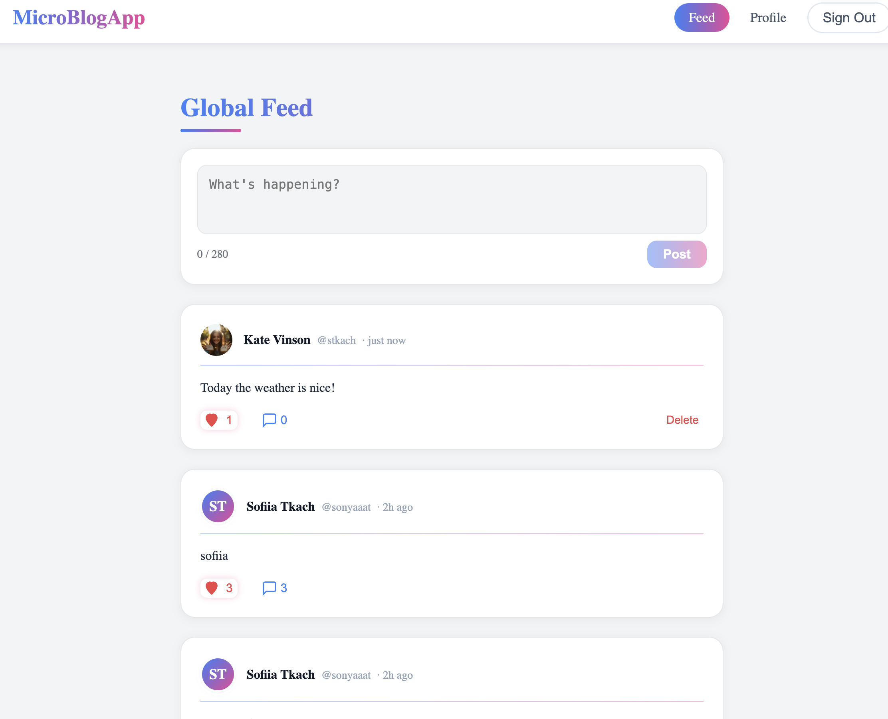
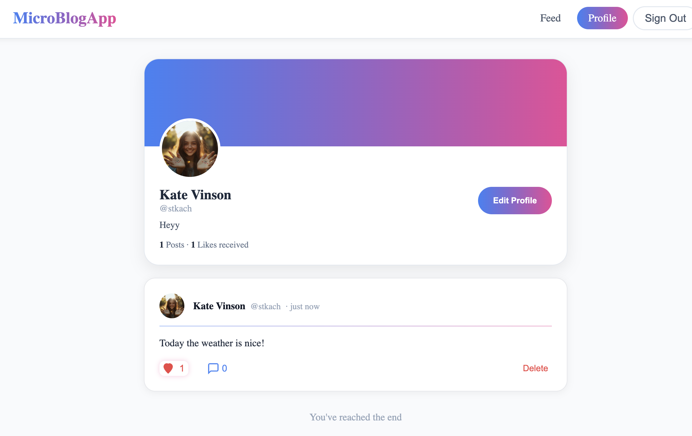
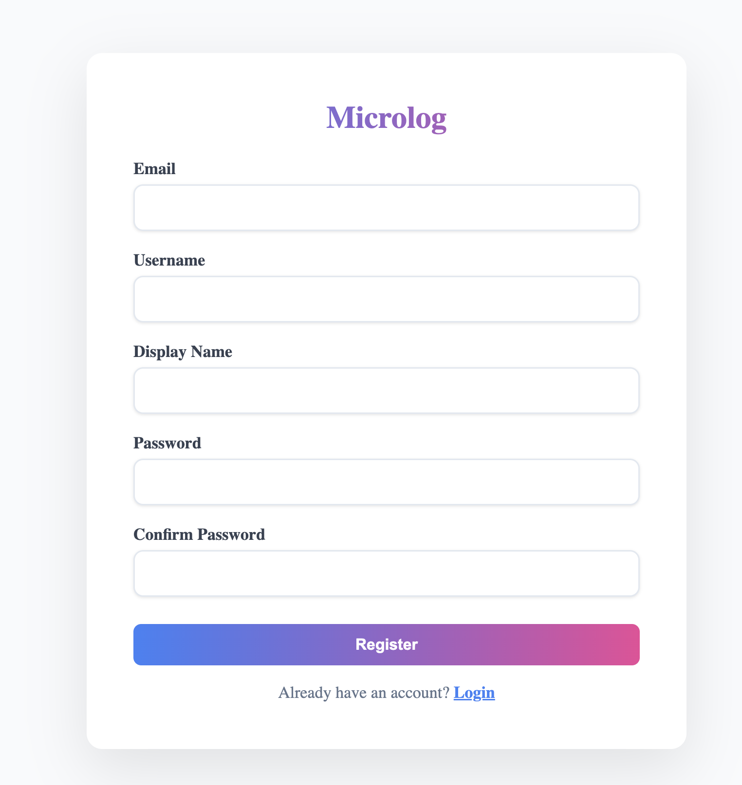

# MicroblogApp 2026 - University of Waterloo - LLM for Software Engineering

## **Author:** Sofiia Tkach


## Screenshots

<!-- Add screenshots here -->

## Feed


## Profile


## Register


## Installation & Setup

```bash
# 1) Clone repository
git clone <your-repo-url>
cd updated_microblogging_app

# 2) Install dependencies
npm install

# 3) Create environment file
cp .env.example .env

# 4) Edit .env and set required values
# NEXTAUTH_SECRET=your_secret_here
# NEXTAUTH_URL=http://localhost:3000
```

If `.env.example` is missing, create `.env` manually with the required variables.

## Run the Application

```bash
npm run dev
```

Open: http://localhost:3000

## Running Tests

Run the full test suite with coverage:

```bash
npx jest --coverage
```

Or use the npm script:

```bash
npm test
```

Run only component tests:

```bash
npx jest --coverage --testPathPatterns=__tests__/components
```

Run only API tests:

```bash
npx jest --coverage --testPathPatterns=__tests__/api
```

Run only the PostCard component tests:

```bash
npx jest --testPathPatterns=PostCard --coverage
```

## Features

- Create account and login
- Post short updates (max 280 characters)
- Global feed with all posts
- Like and unlike posts
- Reply to posts
- View user profiles
- Edit your profile with avatar upload

## Tech Stack

| Layer | Technology |
|---|---|
| Framework | Next.js (App Router) + TypeScript |
| Database | File-based JSON storage (`data/db.json`) |
| Auth | NextAuth.js (Credentials) |
| Styling | Inline styles + Tailwind CSS setup |
| Logging | Winston |